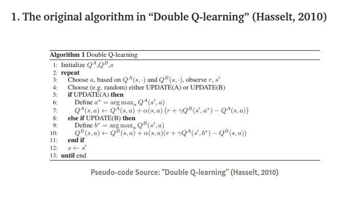
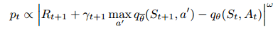
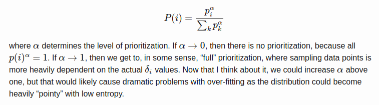
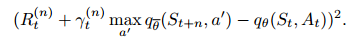

My notes of this [paper](https://arxiv.org/pdf/1710.02298.pdf)

## Abstract

- This paper examines 6 different extensions of the DQN algorithm

## Background of Reinforcement learning

- The paper gives a good intro to the math to just keep you on track.

## Extensions to DQN

### **Double Q-learning**

- Q-learning is affected by an overestimation bias due to the maximization step in the DQN loss function.
- This makes 2 networks one to evaluate and one to choose the right action.
- the update is chosen randomly to update which network
- here is the pseudo code
  

### Prioritized Replay

- Instead of sampling uniformly, the sampling probability differs by the absolute TD error.
  
- w in the equation above is a hyperparameter that determines the shape of the distribution
- here is the equation
  

### Dueling networks

- Remember: Advantage equation is to subtract the value function from the Q-function.
- so basically the network has 2 stream one to compute the advantage and one to compute the value. After learning a lot the Q-function should equal the value function.
- The advantage gives us the intuition whether an action is favorable over other. If it doesn't matter then just no need to learn or take a specific action. We only want to learn in the positions where some actions are more favorable.

### Multi-step learning

- simply instead of looking at one step forward, they look at n-steps
- The now loss function is now like that
  - 

### Distributional
